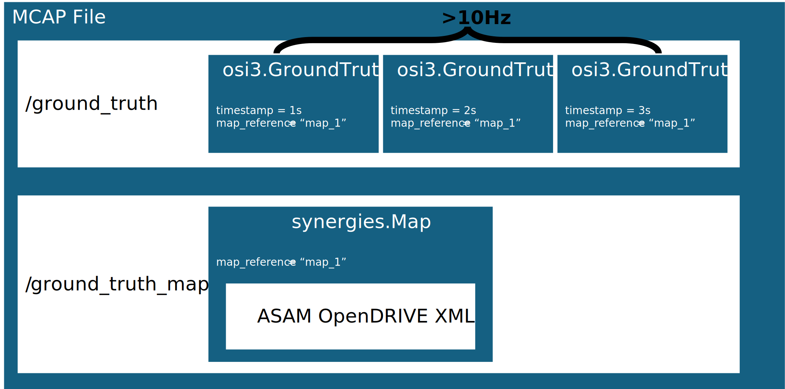

# Omega Specification
Data Model, Format and Python Library for ground truth data of dyanmic objects and maps optimized for representing urban traffic.

- Creation
    - ASAM OSI GroundTruth trace (e.g., output of esmini)
    - Dataframe of moving objects (e.g., csv data)
    - ASAM OpenDRIVE map

You might be looking for the now deprecated [OMEGAFormat legacy]() created in VVMethods project.

Details of how to use the library can be found in [tutorial.ipynb](tutorial.ipynb)

To learn more about the example data read [example_files/README.md](example_files/README.md)

## Installation
`pip install -r requirements.txt`

## File Format
Based on [MCAP](https://mcap.dev/), [ASAM OSI](https://opensimulationinterface.github.io/osi-antora-generator/asamosi/latest/specification/index.html) and [ASAM OpenDRIVE](https://publications.pages.asam.net/standards/ASAM_OpenDRIVE/ASAM_OpenDRIVE_Specification/latest/specification/index.html#)

In contrast to ASAM OSI the Omega specification sets mandatory singals